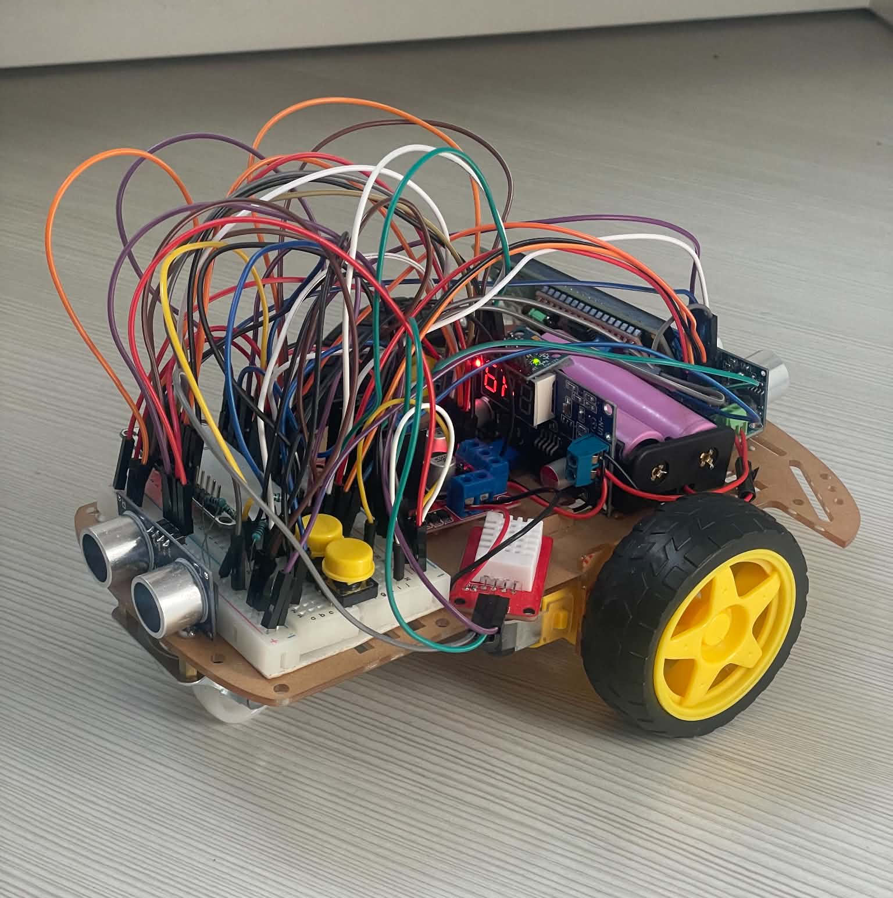
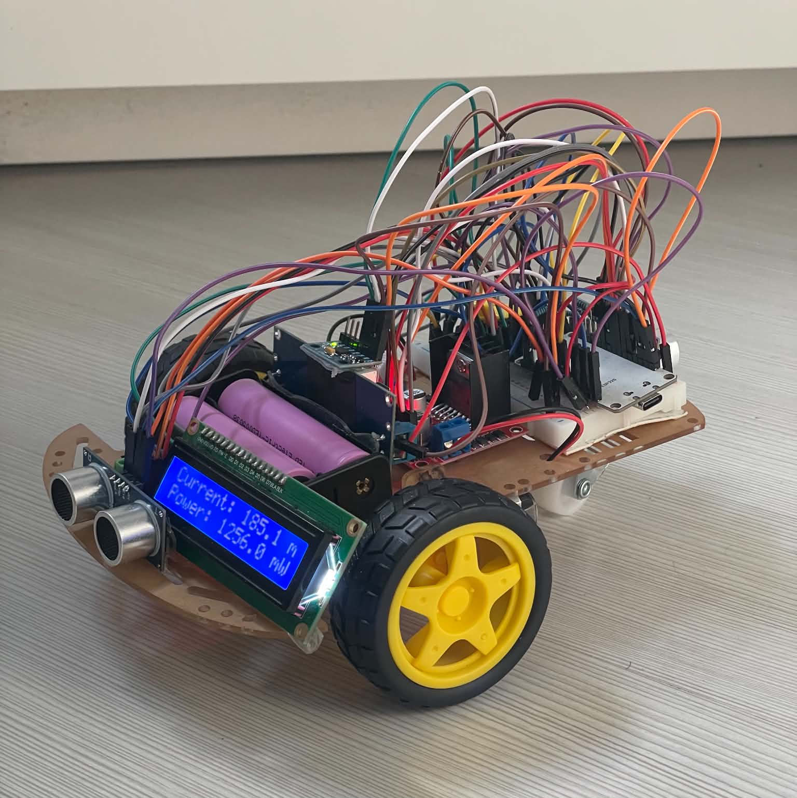
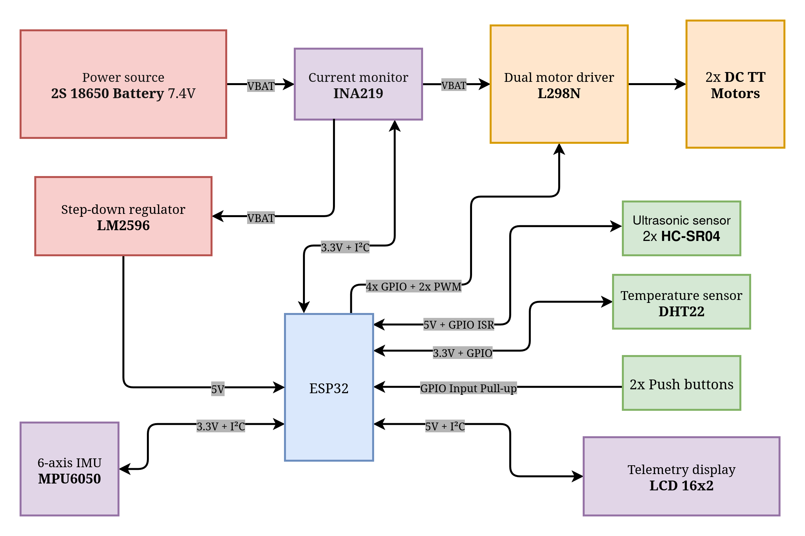

# Ares Rover

An open-source 2WD rover built on the ESP32 platform, combining remote web control with active stability and safety systems. It features closed-loop yaw correction, ultrasonic emergency braking, real-time INA219 power monitoring, and an adaptive Eco mode.

<p align="center">
  
  &nbsp;
  
</p>

## Features

| Function | Implementation |
| --- | --- |
| Straight-line assist | Real-time heading correction using MPU6050 yaw tracking |
| Autonomous emergency braking | Automatic slowdown and stopping based on the time to collision |
| Environmental telemetry | Real-time temperature and humidity monitoring via AM2302 |
| Dynamic power management | Hardware sleep and sensor throttling based on active load |
| Spatial awareness | Front and rear ultrasonic distance measurement |
| Remote control | Manual override via wireless communication |

## Architecture

<p align="center">
  
</p>

## Build and flash
```bash
# Clone the repository
git clone https://github.com/mihaid11/ares-rover.git
cd ares-rover

# Compile the firmware
pio run

# Upload to ESP32 via USB
pio run --target upload

# Open serial monitor (115200 serial baud)
pio device monitor
```

## Documentation
- [Hardware specifications](./docs/hardware_specs.md)
- [Software architecture](./docs/software_design.md)
- [Power management](./docs/power_management.md)
- [Telemetry and metrics](./docs/telemetry_metrics.md)

## License

Ares Rover is open source and distributed under the [MIT LICENSE](LICENSE).
